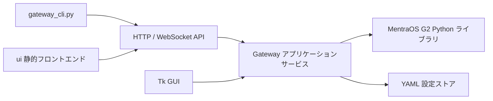
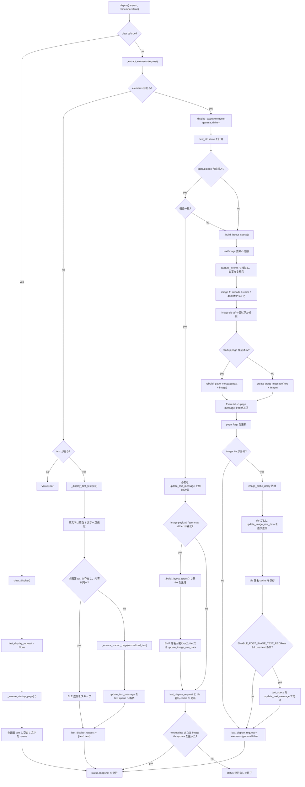
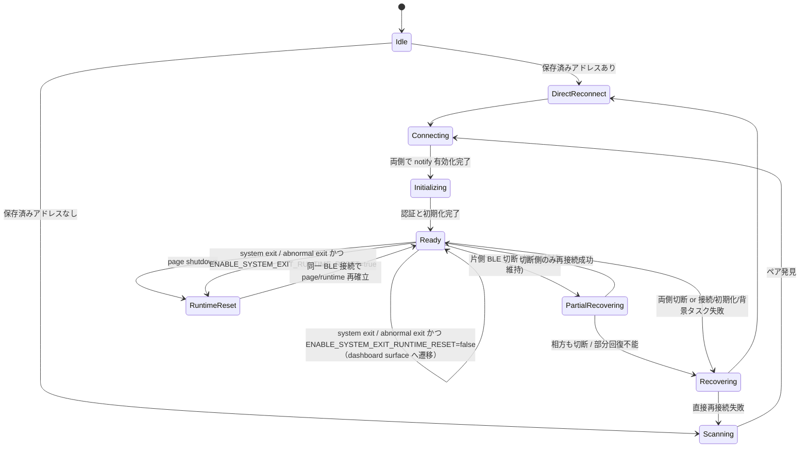
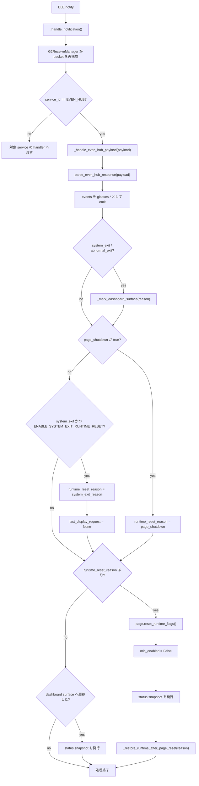

# G2 Gateway 設計

状態: 実装済み。この文書は現在の実装を反映している。

## 1. 目的

このリポジトリでは、以下の3つの成果物を提供する。

1. MentraOS の G2.kt 実装を元に、G2 通信レイヤーを Python に移植した mentraos 配下のライブラリ。
2. gateway_server.py に実装する、HTTP、WebSocket、静的 UI 配信、および任意の Tk GUI を持つゲートウェイサーバー。
3. gateway_cli.py に実装する、テキスト送信、画像送信、マイク制御、ライブイベント監視に対応した CLI。

この設計では、プロトコルコード、実行時状態管理、UI、ライセンス情報を明確に分離する。

## 2. ソース由来の設計境界

現在の Kotlin ソースは、問題領域を以下の単位に分割している。

1. プロトコル定数と列挙体。
2. 最小限の protobuf エンコードとデコード。
3. EvenHub、DevSettings、G2 settings、onboarding、AI configuration 向けのプロトコル別メッセージビルダー。
4. BLE パケット化、CRC16、送信シーケンス、受信再構成。
5. BLE スキャン、ペアリング、GATT 通知有効化、再接続処理。
6. 実行時ページ状態、ハートビートループ、マイク状態、バッテリーポーリング、応答処理。
7. ビットマップ変換と画面更新経路のためのレンダリング補助。

Python 版も同じ境界を維持し、プロトコルロジックがサーバーの外でも再利用できるようにする。

### 2.1 追加された公式 skill の採用方針

追加された Even Hub 公式 skill 群は、今回の gateway 設計では以下の範囲で採用する。

1. 採用する内容: 画面解像度、色深度、コンテナ数上限、イベント捕捉制約、画像コンテナ寸法、テキスト長制約、ページ初期化後でなければ音声制御を呼べない前提。
2. 参照のみに留める内容: Even Hub アプリの配布、パッケージング、バックグラウンド状態、シミュレータ操作、アプリ固有の UX ガイドライン。
3. 今回の gateway は Even Hub アプリそのものではないため、公式 skill のうちアプリ開発専用の内容は制約として採用しない。

## 3. 全体アーキテクチャ



### 実行時モデル

1. BLE クライアントと HTTP / WebSocket サーバーは、1つの asyncio イベントループ上で動作する。
2. GUI モード有効時は、Tk をメインスレッドで動かし、asyncio ランタイムはバックグラウンドスレッドで動かす。
3. no-gui 指定時は、Tk に依存せず asyncio ランタイムをメインスレッドで動かす。
4. BLE レイヤーは正規化済みイベントをブロードキャストハブへ流す。
5. HTTP ハンドラーは、ユーザー入力を表示命令とマイク制御命令へ変換する。
6. WebSocket クライアントは、マイク音声フレームを含むすべての正規化イベントを受信する。

## 4. 想定リポジトリ構成

```text
mentraos/
  __init__.py
  g2/
    __init__.py
    constants.py
    crc.py
    protobuf.py
    transport.py
    scan.py
    render.py
    events.py
    state.py
    client.py
    protocol/
      even_hub.py
      dev_settings.py
      g2_setting.py
      onboarding.py
      even_ai.py
      menu.py

gateway_server.py
gateway_cli.py
gateway_config.py
MentraOS_LICENSE
ui/
  index.html
  app.js
  styles.css
config/
  gateway.yaml
```

### 分離ルール

1. プロトコル直列化、パケット化、CRC、protobuf ヘルパーは HTTP、Tk、CLI コードに依存してはならない。
2. mentraos 配下には、G2.kt 由来のプロトコル、通信、状態管理、描画処理、およびそのライセンス関連以外を置かない。
3. 帰属情報ファイルは実行時モジュールへ混在させない。
4. gateway_server.py はサービスを組み立てる役割に留め、低レベル BLE パケットロジックを持たない。
5. gateway_cli.py は HTTP と WebSocket を使う薄いクライアントとして保つ。

## 5. ゲートウェイ共通層と mentraos 配下ライブラリ設計

### 5.1 gateway_config.py

責務:

1. gateway.yaml の読み込みと保存。
2. 最後に接続した G2 ペアのアドレスとシリアル番号の永続化。
3. サーバー設定、BLE タイミング設定、UI 関連設定、CORS、API キー認証設定の保持。
4. 保存時に設定ファイル破損を避けるため、原子的な置き換えを使う。

設定モデル案:

```yaml
server:
  host: 0.0.0.0
  port: 8765
  websocket_path: /ws
  static_dir: ui
glass:
  search_id: ""
  left_address: ""
  right_address: ""
  left_mac_address: ""
  right_mac_address: ""
  last_serial_number: ""
ble:
  scan_timeout_sec: 5
  reconnect_interval_sec: 5
  heartbeat_interval_sec: 5
  ble_packet_gap_ms: 8
  text_queue_interval_ms: 100
  image_settle_delay_ms: 1000
  image_fragment_interval_ms: 200
  unpair_on_startup: false
gui:
  enabled: true
cors:
  enabled: false
  allow_origins: []
  allow_methods: ["GET", "POST", "OPTIONS"]
  allow_headers: ["Content-Type", "Authorization", "X-API-Key"]
  allow_credentials: false
  max_age: 600
auth:
  api_key: ""
  header_name: X-API-Key
  query_parameter: api_key
```

このモジュールは mentraos 配下には置かず、ゲートウェイの共通層として扱う。

### 5.2 g2/constants.py

責務:

1. write、notify、audio notify、service UUID、CCCD の UUID 定義。
2. Service ID 定義。
3. Kotlin ソース由来のコマンド列挙体定義。
4. 公式 Even Hub 制約に基づく画面定数の定義。画面は 576x288 px、4-bit グレースケール 16 階調とする。
5. コンテナ制約定数の定義。1ページあたり総数 12 以下、text/list は 8 以下、image は 4 以下、containerName は 16 文字以下とする。
6. 画像コンテナ寸法制約の定義。幅は 20-288 px、高さは 20-144 px とする。
7. パケットサイズおよびペイロードサイズ定数の定義。

### 5.3 g2/crc.py

責務:

1. Kotlin 実装と一致する CRC16 実装。
2. BLE やアプリケーションに依存しない純粋関数としての提供。

### 5.4 g2/protobuf.py

責務:

1. varint、bytes、string、bool、ネストメッセージに対応した最小 protobuf writer。
2. 応答処理で必要となる field parsing 用の最小 protobuf reader。
3. protobuf コード生成に依存しない構成。

理由:

Kotlin ソースは生成済みクラスではなく、手書きの protobuf 最小実装を使っている。Python 版もその挙動を維持し、パケットバイト列が予測可能であることを優先する。

### 5.5 g2/protocol/*.py

責務:

1. even_hub.py: ページ生成、ページ再構築、テキスト更新、画像生データ更新、ハートビート、音声制御。
2. dev_settings.py: 認証、pipe role change、時刻同期、base heartbeat、ring connect info。
3. g2_setting.py: device info 要求と基本デバイス設定。
4. onboarding.py: onboarding skip コマンド。
5. even_ai.py: Hey Even の有効化と無効化。
6. menu.py: 任意の dashboard menu 連携。初回サーバーマイルストーンでは受動的な互換コードのみを保持し、HTTP API、CLI、UI からは露出しない。

設計ルール:

各モジュールは純粋なバイト列ビルダー関数のみを公開する。asyncio、BLE クライアント、UI を持ち込まない。

また、even_hub.py では以下のページ構築制約を検証できるようにする。

1. containerID はページ内で一意であること。
2. containerName はページ内で一意であり、16 文字以下であること。
3. 総コンテナ数は 12 以下であること。
4. text/list コンテナ数は 8 以下であること。
5. image コンテナ数は 4 以下であること。
6. イベント捕捉可能なコンテナのうち、ちょうど 1 個だけが capture 対象であること。

### 5.6 g2/transport.py

責務:

1. 送信ペイロードを G2 BLE パケットへフレーム化する。
2. sync ID と MagicRandom カウンタを管理する。
3. 複数パケットに分割された受信ペイロードを再構成する。
4. 左右ストリームが混線しないよう、左右識別キーを受信バッファのキーに含める。

### 5.7 g2/scan.py

責務:

1. Bleak を使って G2 デバイスをスキャンする。
2. manufacturer data からシリアル番号を抽出する。
3. manufacturer data から MAC アドレスを抽出する。
4. シリアル番号で左右デバイスを対応付ける。
5. 高速再接続のため、スキャン前に保存済み左右アドレスを優先する。

### 5.8 g2/render.py

責務:

1. base64 または data URL 画像をデコードする。
2. 画像を対象領域へリサイズし、必要ならレターボックス化する。
3. グレースケールへ変換する。
4. オプションでガンマ補正を行う。ガンマ値は LUT 経由で適用し、1.0 では変換なし。
5. オプションで Floyd-Steinberg ディザリングを行い、4-bit 16 階調での表現品質を向上させる。
6. デバイスが期待する 4-bit BMP ペイロードを生成する。
7. 単一画像コンテナの公式制約である 20-288 px 幅、20-144 px 高さを超える論理画像を、内部で複数コンテナへ分割する。
8. updateImageRawData 相当の画像送信は逐次処理とし、並列送信しない前提を守る。
9. 生成済みタイルの BMP ペイロードは、同一レイアウト構造での差分送信用に署名化できる形で返す。

ガンマ/ディザリングの制御方法:

1. サーバー起動時の `--image-gamma FLOAT` と `--image-dither` フラグで既定値を設定する。
2. POST /api/display リクエストの `gamma` / `dither` フィールドで、リクエスト単位に上書きできる。

重要な設計判断:

Kotlin 側では 576x288 画像を 288x144 の4タイルへ分割して送る安全経路が確認できる。そのため Python 側レンダラーも、外部 HTTP ペイロードではレイアウト指向を維持しつつ、BLE 転送時は公式上限と安全経路の両方を満たすように内部タイル分割を行えるようにする。

### 5.9 g2/events.py

責務:

1. 正規化済みイベントエンベロープを定義する。
2. 低レベルパケット応答を型付きイベントペイロードへ変換する。
3. WebSocket クライアントと CLI 利用者向けに安定したイベント名を保つ。
4. protobuf 既定値が wire 上で省略される前提を踏まえ、0 値イベントを欠落フィールドとして正規化できるようにする。

イベントエンベロープ案:

```json
{
  "seq": 42,
  "kind": "glasses.touch",
  "timestamp": "2026-05-25T12:34:56.123Z",
  "data": {
    "gesture": "single_tap",
    "source": 0
  }
}
```

kind 候補一覧:

1. status.snapshot
2. connection.state
3. glasses.touch
4. glasses.mic_audio
5. glasses.battery
6. glasses.firmware
7. glasses.authentication
8. glasses.dashboard
9. glasses.raw_packet
10. system.error
11. system.reinitialize

glasses.dashboard は将来拡張用の予約イベントとし、初回サーバーマイルストーンでは受動的互換コードに留める。glasses.raw_packet は通常配信対象に含めず、デバッグフラグ有効時のみ補助イベントとして配信する。

### 5.10 g2/state.py

責務:

1. 現在のページ所有状態を追跡する。
2. 初期ページが存在するかを追跡する。
3. 現在ページにテキストコンテナがあるか、およびそれが全画面テキストコンテナかを追跡する。
4. 再接続や page/runtime reset 後に復元できるよう、最後の display request と目標マイク状態を保持する。
5. 最終バッテリー状態、認証状態、現在の接続フェーズを追跡する。
6. 最後に受信したタッチジェスチャーの種別 (`last_gesture`) を追跡する。
7. 現在ページへ送信済みの image tile BMP 署名を追跡する。

レイアウト用の `last_display_request` には `elements` に加えて `gamma` および `dither` も保持する。これにより、ガンマ/ディザが変わった場合もシームレスに差分検出できる。
`current_image_tile_signatures` は containerID ごとのレンダリング済み BMP 署名を保持し、同一ページ構造の画像更新で未変更タイルの再送信を避ける。ページ所有状態を失う reset、clear、テキスト専用ページへの遷移、またはレイアウト構造変更時には破棄する。

### 5.11 g2/client.py

これは高レベル非同期デバイスクライアントである。

責務:

1. 左右レンズへ接続する。
2. 通知チャネルおよび音声通知チャネルを有効化する。
3. 初期化シーケンスを実行する。
4. ハートビートループを維持する。
5. display、clear、set_mic_enabled、request_device_info、start、stop などの高レベル操作を提供する。
6. 通知を正規化イベントへ変換する。
7. 切断後に自動再接続する。
8. ページ終了通知後に、BLE 再接続なしで runtime/page 状態を速やかに再初期化する。system exit / abnormal exit 起因の再初期化は `ENABLE_SYSTEM_EXIT_RUNTIME_RESET` が true の場合だけ行う。
9. 再接続後にマイク状態と表示状態を復元する。

公開インターフェース:

```text
class G2Client:
  async start()
  async stop()
  async display(request, remember=True)
  async clear_display()
  async set_mic_enabled(enabled)
  async request_device_info()
  async record_touch_gesture(gesture: str)  # HTTP 注入タッチを state へ反映し status.snapshot を発行
  get_status() -> dict
```

## 6. 初期化シーケンス

Python クライアントは、Kotlin 実装で確認できる初期化順序を維持するべきである。デバイス側が順序とタイミングに敏感である可能性が高いためである。

初期化手順案:

1. 左右両方へ接続する。
2. 通知チャネルおよび音声通知チャネルの通知を有効化する。
3. 左右を認証する。
4. pipe role change を送信する。
5. 時刻同期を送信する。
6. onboarding を skip する。
7. 設定で上書きしない限り Hey Even を無効化する。
8. Kotlin 実装が使っている G2 settings および control packet を送信する。
9. startup page を確立する。マイク要求が先に来る可能性があるため、この段階で空白 1 文字を持つ全画面テキストコンテナのページを用意し、Even Hub の前提条件を満たす。
10. device info を要求する。
11. ハートビートループを開始する。

タイミング方針:

1. 初期化時の小さなコマンド間隔を保持する。
2. 連続送信時の BLE packet gap は約 8 ms を維持する。
3. EvenHub heartbeat と DevSettings heartbeat は、それぞれ独立した 5 秒タイマーで動かす。
4. audioControl は startup page 成功後にのみ呼び出す。

## 7. 表示パイプライン設計

### 7.1 リクエスト正規化

ゲートウェイは、論理的に2つの表示経路を受け付ける。

#### 共通制約

1. 画面キャンバスは 576x288 px、原点は左上、色深度は 4-bit グレースケール 16 階調とする。
2. 1ページあたりのコンテナ総数は 12 以下とする。
3. 1ページあたりの text/list コンテナ数は 8 以下、image コンテナ数は 4 以下とする。
4. containerID はページ内で一意、containerName もページ内で一意かつ 16 文字以下とする。
5. image コンテナはイベント捕捉できないため、各ページには text または list の capture 対象コンテナがちょうど 1 個必要である。
6. text/list コンテナがあるレイアウトで capture 指定が 0 個の場合は、gateway が先頭の text コンテナを capture 対象へ補完する。
7. text/list コンテナが存在しない画像中心レイアウトでは、gateway が全画面テキストコンテナ 1 個を入力レイヤーとして補完する。この補完コンテナの内容は空白 1 文字とする。
8. textContainerUpgrade 相当の in-place 更新は 1 コンテナあたり 2000 文字以下とし、createStartUpPageContainer および rebuildPageContainer に載せる初期テキストは UTF-8 エンコード後で 1 コンテナあたり 1000 バイト以下とする。日本語などのマルチバイト文字列では、見かけの文字数が 1000 未満でも超過しうる。
9. 新規ページ作成または再構築が必要で、かつ初期テキストの UTF-8 エンコード後サイズが 1000 バイトを超える場合は、gateway はまず安全なプレースホルダー文字列でページを確立し、その後に text upgrade で実テキストを反映する。
10. 画像コンテナの寸法は、単一コンテナあたり幅 20-288 px、高さ 20-144 px の範囲に収める。これを超える論理画像は複数 image コンテナへ分割する。
11. 画像データ反映は逐次送信とし、複数 image 更新を並列に流さない。同一レイアウト構造での後続更新では、レンダリング後 BMP 署名が変わった tile のみを送信する。
12. mixed image+text レイアウトでは、create/rebuild page message に text content を含める。画像 raw data 送信後の追加 text redraw は `ENABLE_POST_IMAGE_TEXT_REDRAW` が true の場合だけ実行する。現在の既定値は false。

#### 高速テキスト経路

条件:

1. ペイロードがプレーンテキストのみを含む。
2. 位置指定フィールドが存在しない。
3. 画像が存在しない。

挙動:

1. 既に全画面テキストコンテナがある場合のみ、それを再利用する。
2. テキストコンテナが存在しない場合、または存在しても全画面テキストコンテナでない場合は、全画面テキストコンテナを持つ初期ページへ再構築する。
3. テキスト更新はスロットリング付き text queue を通して送る。
4. G2 の仕様上、空文字は送信できないため、正規化後のテキスト長が 0 の場合は、送信値として空白文字 1 文字へ置き換える。

**重複送信スキップ**: 全画面テキストコンテナが既に存在し、かつ `current_text_content` が新しいテキストと同一の場合は BLE 送信をスキップする。ページ再構築が必要な状況 (切断後、clear 後) では常に送信する。

理由:

これは Kotlin 実装で確認できる最も低遅延な経路と一致する。

#### レイアウト経路

条件:

1. いずれかの画像が存在する。
2. 1件以上の位置指定付きテキストが存在する。
3. 複数要素が存在する。

挙動:

1. 入力を、0個以上の text element と 0個以上の image element に正規化する。
2. 複数のテキスト配置を許容し、必要な数のテキストコンテナと画像コンテナを持つページを組み立てる。
3. イベント捕捉対象が存在しない場合は、gateway が capture 対象コンテナを自動補完する。
4. 各画像領域について、必要に応じて変換とタイル分割を行い、新規ページ作成または再構築時は全 tile の raw image update を逐次送る。
5. mixed image+text レイアウトでは、画像コンテナを先に、text コンテナを後に page message へ載せる。追加の text update 再描画は端末側の page drop を誘発しうるため既定では行わない。
6. 後続更新で安全に rebuild できるよう、ページ状態を記録する。

**重複送信スキップ**: ページ構造 (text/image コンテナ構成) が一致する場合は rebuild を避け、必要な text update と image tile update だけを送る。画像は `image_base64`、`gamma`、`dither` のいずれかが変化した場合に再レンダリングし、BMP 署名が変わった tile だけを `update_image_raw_data` で送信する。elements・gamma・dither とレンダリング後 tile が完全一致する場合は BLE 送信が 0 件になる。構造変化 (切断後、clear 後、surface 変化後) では常に再構築する。

#### 現在の表示処理フロー



### 7.2 HTTP リクエスト形状

対応形状:

```json
{
  "text": "optional fast text",
  "clear": false,
  "gamma": 1.0,
  "dither": false,
  "elements": [
    {
      "type": "text",
      "text": "header",
      "x": 0,
      "y": 0,
      "width": 576,
      "height": 50,
      "border_width": 0,
      "border_color": 0,
      "border_radius": 0,
      "padding": 4,
      "capture_events": false
    },
    {
      "type": "text",
      "text": "body text",
      "x": 0,
      "y": 60,
      "width": 576,
      "height": 72,
      "border_width": 0,
      "border_color": 0,
      "border_radius": 0,
      "padding": 4,
      "capture_events": false
    },
    {
      "type": "image",
      "image_base64": "...",
      "x": 0,
      "y": 144,
      "width": 288,
      "height": 144
    }
  ]
}
```

elements には複数の text 要素を含めてよく、それぞれ独立した位置とサイズを持てる。

text フィールドが空文字の場合でも、clear とは別物として扱う。G2 へ実送信する段階では、空文字の代わりに空白文字 1 文字へ正規化する。

追加のバリデーションと補完ルール:

1. elements 総数は 12 以下とする。
2. text 要素数は 8 以下、image 要素数は 4 以下とする。ただし image-only レイアウトでは gateway が入力レイヤー用の text コンテナを内部補完する。
3. image 要素の width は 20-288、height は 20-144 の範囲に収める。単一要素でこれを超える場合は、HTTP 受理後に gateway 内部で複数コンテナへ分割する。
4. containerName を外部入力として受ける場合は 16 文字以下とする。
5. capture_events が複数要素で true の場合は拒否する。
6. capture_events が 0 個で text 要素がある場合は先頭 text 要素を capture 対象へ補完する。
7. create/rebuild に直接載る text 要素は UTF-8 エンコード後 1000 バイト以下を原則とし、それを超える場合は placeholder 作成後に in-place upgrade で反映する。

正規化ルール:

1. text 単独なら高速テキスト経路へ送る。
2. clear が true なら現在ページ状態を空表示へ戻す。
3. elements があればレイアウト経路へ送る。

### 7.3 clear の意味論

優先挙動:

1. キャッシュしている display request を消去する。
2. 完全な BLE 再接続を強制せず、現在表示中の内容を空ページまたは空テキストコンテナへ置き換える。
3. 空テキストコンテナ相当の表示を作る場合でも、G2 へは空文字を送らず、空白文字 1 文字を送る。
4. clear は shutDownPageContainer を既定動作にせず、ページ所有権を維持したまま空表示へ更新する。

これによりページ所有状態を安定させ、不要な再初期化を避けられる。

## 8. BLE 接続と回復設計

### 8.1 接続フロー



### 8.2 回復トリガー

BLE 再接続を伴う回復処理は、以下で開始する。

1. 左右いずれかの BLE 切断。
2. 接続または初期化シーケンスの失敗。
3. heartbeat/text queue 等の背景タスク失敗。

### 8.3 BLE 回復時の挙動

1. full reconnect の場合はページ状態フラグをリセットし、左右両方の再接続と初期化を再実行する。
2. partial reconnect（片側のみ切断）の場合は、生きている側を維持したまま切断側だけ再接続する。
3. 回復後に両側が ready へ戻った時点で、`last_display_request` が残っていれば表示を復元する。
4. 目標マイク状態が有効なら再適用する。

### 8.4 接続維持時の runtime reset

以下のイベントは、BLE 再接続ではなく、既存接続を保ったまま page/runtime 状態だけを戻す契機として扱う。

1. ページ所有権喪失を示すページ終了応答。
2. `ENABLE_SYSTEM_EXIT_RUNTIME_RESET` が true の場合に限り、EvenHub からの system exit イベント。
3. `ENABLE_SYSTEM_EXIT_RUNTIME_RESET` が true の場合に限り、EvenHub からの abnormal exit イベント。

現在の既定値では `ENABLE_SYSTEM_EXIT_RUNTIME_RESET` は false である。この場合でも SYSEXIT / abnormal exit で dashboard surface へ遷移し、page flags は reset される。`last_display_request` の消去と startup page 再確立は行わない。

挙動:

1. ページ状態フラグをリセットする。
2. `ENABLE_SYSTEM_EXIT_RUNTIME_RESET` が true の system exit / abnormal exit 発生時は、ユーザーが手動停止した可能性を優先して `last_display_request` を消去する。
3. startup page を同一 BLE 接続上で再確立する。
4. 目標マイク状態が有効なら再適用する。
5. `last_display_request` が残っている場合に限り、最後の display request を復元する。

#### 現在の回復判定フロー



## 9. イベント配信設計

### 9.1 WebSocket エンドポイント

エンドポイント案:

1. GET /ws

挙動:

1. 複数クライアントの同時接続を受け付ける。
2. すべての正規化イベントを全クライアントへブロードキャストする。ただし glasses.raw_packet は既定では配信せず、デバッグフラグ有効時のみ配信する。
3. 接続直後に状態スナップショットを送る。
4. 遅いクライアントが BLE 処理全体を止めないよう、クライアントごとのキューを持つ。
5. クライアントキューが溢れた場合は、そのクライアントのみを切断する。

### 9.2 マイク音声イベント方針

要件では、マイクストリーミングを全クライアントへ転送する必要がある。

方針:

1. 受理したすべてのマイクフレームを WebSocket イベントとして転送する。
2. バイナリ音声フレームは base64 で符号化する。
3. 下流ツールがフレーム境界を解釈できるよう frame_size を含める。
4. Kotlin 実装と同様、直前と完全一致するフレームは重複排除する。

## 10. HTTP API 設計

### 10.1 POST /api/display

目的:

1. 高速テキストまたはレイアウトペイロードを送信する。

応答例:

```json
{
  "accepted": true,
  "mode": "fast_text",
  "queued": false
}
```

### 10.2 POST /api/mic

リクエスト:

```json
{
  "enabled": true
}
```

目的:

1. グラス側のマイク状態を切り替える。

### 10.3 GET /api/status

目的:

1. ブラウザ UI と Tk GUI 向けに、現在のサーバー状態と BLE 状態を返す。

候補フィールド:

1. 待受ホストとポート
2. BLE connection state
3. ready flag
4. 保存済みペアアドレス
5. 最終シリアル番号
6. マイク状態
7. バッテリー残量と充電状態
8. 最終エラー
9. 最後に受信したジェスチャー (`last_gesture`)

### 10.5 POST /api/touch

目的:

1. HTTP 経由でタッチジェスチャーを注入し、実際のグラスタッチと同等のイベントとして扱う。

リクエスト:

```json
{
  "gesture": "single_tap"
}
```

受理できる gesture 値: `single_tap`, `double_tap`, `swipe_up`, `swipe_down`

挙動:

1. `glasses.touch` イベントを生成してすべての WebSocket クライアントへ配信する。
2. `G2Client.record_touch_gesture()` を呼び出して `last_gesture` を更新し、`status.snapshot` を発行する。
3. 無効な gesture 値には 400 を返す。

応答例:

```json
{
  "accepted": true,
  "gesture": "single_tap"
}
```

### 10.4 静的ファイル配信

目的:

1. 同一ゲートウェイプロセスから ui ディレクトリを配信する。

ルート方針:

1. / は index.html を返す。
2. /assets または直接ファイルパスで JS と CSS を返す。

## 11. Tk GUI 設計

GUI は装飾目的ではなく運用目的である。

最小ウィジェット:

1. 現在の待受アドレスとポート。
2. 接続フェーズ。
3. 準備完了 / 未完了の表示。
4. 最後に発見または接続したシリアル番号。
5. 左右アドレス。
6. マイク状態。
7. バッテリーと充電状態。
8. 最終エラー。
9. 最後に受信したジェスチャー (`last_gesture`)。
10. 最新イベントを表示するスクロール付きイベントログ。
11. ブラウザで WebUI を開くボタン。
12. 保存済みアドレスをクリアするボタン。

イベントログ表示形式:

各行を `[HH:MM:SS] kind  key=val key=val ...` の形式で整形し、生 JSON を表示しない。

スレッド方針:

1. Tk はメインスレッドで動かす。
2. asyncio ランタイムは状態スナップショットをスレッドセーフなキューへ流す。
3. Tk は短い間隔でキューをポーリングし、BLE オブジェクトへ直接触れずにラベルを更新する。

コマンドラインフラグ:

1. --no-gui で Tk 起動を完全に無効化する。

## 12. ブラウザ UI 設計

ブラウザ UI は意図的に簡素にし、主用途を確認と手動試験に置く。

最小機能:

1. 現在の状態スナップショット表示 (last_gesture を含む)。
2. マイクのオンオフ切り替え。
3. テキストペイロードの送信。
4. 画像またはレイアウト JSON ペイロードの送信 (gamma / dither オプション付き)。
5. ライブ WebSocket イベントストリームの表示。
6. タッチ操作パネル (上スワイプ、下スワイプ、シングルタップ、ダブルタップ) で POST /api/touch を呼び出す。

後続実装メモ:

ブラウザ側はビルド工程なしの静的 HTML、CSS、JavaScript に留める。

## 13. CLI 設計

CLI はデバッグ用途と AI エージェント利用を想定するため、明示的かつスクリプトで扱いやすいインターフェースにする。

コマンド案:

1. send-text --text "hello"
2. send-image --file image.png --x 0 --y 0 --width 288 --height 144 [--image-gamma FLOAT] [--image-dither]
3. send-json --file payload.json [--image-gamma FLOAT] [--image-dither]
4. mic --on
5. mic --off
6. events
7. status

出力方針:

1. 既定では人間可読。
2. 自動化向けに JSON Lines モードを任意提供。
3. 通信失敗や入力検証失敗時は非ゼロ終了コードを返す。

## 14. ライセンスと帰属表示設計

要件では、ライセンス記載を主要処理ファイルから分離することが明示されている。

予定する扱い:

1. リポジトリルートの LICENSE は本プロジェクト用として維持する。
2. MentraOS のライセンス文面はリポジトリルートの MentraOS_LICENSE として保持する。
3. 帰属情報ファイルは実行時コードから分離したまま保つ。

この方針により、主要 BLE モジュールへ NOTICE を混在させずに由来情報を保持できる。

## 15. 依存関係計画

予定する Python 依存:

1. bleak: BLE 用。
2. aiohttp: HTTP、WebSocket、静的ファイル配信用。
3. Pillow: 画像変換用。
4. PyYAML: 設定永続化用。

aiohttp を分割構成より優先する理由:

1. 1つのフレームワークで HTTP、WebSocket、静的ファイル配信をカバーできる。
2. BLE タスクとサーバータスクを同じ asyncio ランタイムで動かせる。
3. GUI モードでも asyncio ループをバックグラウンドスレッドへ移すことで共存できる。

## 16. 実装開始後の検証計画

### 単体テスト

1. CRC16 が Kotlin 出力と一致すること。
2. Protobuf writer と reader の、対応フィールド型に対する往復検証。
3. パケット分割と再構成。
4. manufacturer data からのシリアル番号と MAC 抽出。
5. 画像変換とタイルサイズ決定。
6. image tile BMP 署名による変更タイル抽出。

### 結合テスト

1. HTTP リクエスト正規化が高速テキスト経路とレイアウト経路へ正しく分岐すること。
2. WebSocket イベントが複数クライアントへ配信されること。
3. ペアアドレスの設定永続化。
4. 切断シミュレーション後の回復。
5. 同一レイアウト構造の画像更新で、ページ再構築を避け、未変更 tile を再送信しないこと。

### 実機手動テスト

1. 初回ペアリングとアドレス保存。
2. プロセス再起動後に直接再接続経路が使えること。
3. 高速テキスト表示。
4. テキストと画像を混在させたレイアウト表示。
5. マイクのオンとオフ。
6. WebSocket でのマイクストリーミング観測。
7. デバイス側 exit 後の回復。

## 17. 実装前の未確定事項

現時点で、初回サーバーマイルストーンを止める未確定事項はない。

## 18. 推奨実装順序

実装開始時は、以下の順序が最もリスクを抑えやすい。

1. 純粋プロトコルモジュール: constants、crc、protobuf、transport。
2. scan と config 永続化。
3. 接続、notify、auth、heartbeat、正規化イベントを含む G2 client。
4. 高速テキスト表示経路。
5. 画像タイル分割を含む layout renderer。
6. HTTP / WebSocket サーバー。
7. Tk GUI。
8. CLI。
9. 静的ブラウザ UI。

この順序なら、UI 面が増える前に BLE 挙動を検証できる。
