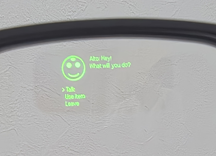

# G2 BLE Gateway

> English version: [README.md](README.md)

[Even Realities G2](https://www.evenrealities.com/) スマートグラスを HTTP・WebSocket・ブラウザ UI へ橋渡しする Python ゲートウェイです。  
BLE 通信レイヤーは [MentraOS](https://github.com/Mentra-Community/MentraOS) の `G2.kt` 実装を Python へ移植したものです。

クラウド・インターネット不要で、ローカル完結で動作します。



---

## 機能

- **BLE 接続管理** — 左右レンズの自動ペアリング・再接続・ハートビート
- **高速テキスト経路** — in-place update による低遅延全画面テキスト表示
- **レイアウト経路** — 位置指定付きテキストと画像コンテナを持つ複合ページ
- **画像レンダリング** — base64/data-URL 画像を 4-bit BMP へ変換し、デバイス制約内でタイル分割
- **マイク制御** — グラスのマイクを ON/OFF、音声フレームを WebSocket でストリーミング
- **WebSocket ブロードキャスト** — 全正規化イベントを接続中の全クライアントへ配信
- **Tk GUI** — 接続フェーズ・バッテリー・マイク・ファームウェア・イベントログのライブ表示
- **ブラウザ UI** — 同一プロセスから配信される静的 HTML フロントエンド。画像とテキストをまとめて送れるレイアウト合成フォームを含む
- **CLI** — テキスト・画像・マイク制御・イベント監視に対応したコマンドラインクライアント
- **設定永続化** — `config/gateway.yaml` に直近の接続ペア情報を保存し、次回起動を高速化

---

## 要件

- Python 3.11 以上
- [Bleak](https://github.com/hbldh/bleak) がアクセスできる Bluetooth アダプタ

### Python 依存パッケージ

```
aiohttp
bleak
Pillow
PyYAML
```

インストール:

```bash
pip install -r requirements.txt
```

---

## クイックスタート

### 1. ゲートウェイサーバーの起動

```bash
python gateway_server.py
```

Tk GUI を無効にして起動（ヘッドレス）:

```bash
python gateway_server.py --no-gui
```

追加オプション:

| フラグ | 説明 |
|---|---|
| `--config PATH` | YAML 設定ファイルのパス（既定: `config/gateway.yaml`） |
| `--host HOST` | 待受ホストを上書き |
| `--port PORT` | 待受ポートを上書き |
| `--search-id ID` | BLE スキャンを特定のシリアル番号プレフィックスに限定 |
| `--no-gui` | Tk ステータスウィンドウを起動しない |
| `--debug-raw-events` | `glasses.raw_packet` イベントを WebSocket へ含める |
| `--log-level LEVEL` | Python ロギングレベル（既定: `INFO`） |
| `--clear-saved-addresses` | 保存済みグラスアドレスを起動時に消去して再スキャン |
| `--unpair-on-startup` | 保存済みアドレスを起動時に OS レベルでアンペアし、今回の実行では再スキャン |
| `--image-gamma FLOAT` | 全画像に適用するデフォルトガンマ補正（1.0 = なし、<1.0 = 明るい; 既定: `1.0`） |
| `--image-dither` | 全画像に 4-bit Floyd-Steinberg ディザリングを有効化 |

初回起動時は G2 ペアをスキャンして接続し、初期化シーケンスを実行した後、発見したアドレスを `config/gateway.yaml` へ保存します。次回以降の起動では保存済みアドレスへ直接接続します。

### 2. ブラウザ UI を開く

`http://127.0.0.1:8765` へアクセスすると、ステータス確認と手動試験用の UI が表示されます。
レイアウト合成フォームでは、JSON を手で編集しなくても画像と位置指定テキストを同時に送信できます。

---

## 設定

`config/gateway.yaml` は存在しない場合に自動生成されます。全項目は CLI フラグで上書きできます。

```yaml
server:
  host: 0.0.0.0
  port: 8765
  websocket_path: /ws
  static_dir: ui

glass:
  search_id: ""          # 任意: シリアル番号のプレフィックスでフィルタ
  left_address: ""       # 初回接続後に自動設定
  right_address: ""
  left_mac_address: ""
  right_mac_address: ""
  last_serial_number: ""

ble:
  scan_timeout_sec: 5
  reconnect_interval_sec: 5
  heartbeat_interval_sec: 5
  ble_packet_gap_ms: 8
  text_queue_interval_ms: 100
  image_settle_delay_ms: 1000
  image_fragment_interval_ms: 200
  unpair_on_startup: false

gui:
  enabled: true
```

---

## HTTP API

### `POST /api/display`

テキストまたはレイアウトをグラスへ送信します。

**高速テキスト**（最小レイテンシ）:

```json
{ "text": "こんにちは、世界！" }
```

**レイアウト**（位置指定テキストと画像の組み合わせ）:

```json
{
  "elements": [
    {
      "type": "text",
      "text": "ヘッダー",
      "x": 0, "y": 0, "width": 576, "height": 50,
      "capture_events": true
    },
    {
      "type": "image",
      "image_base64": "<base64 または data URL>",
      "x": 0, "y": 60, "width": 288, "height": 144
    }
  ]
}
```

**表示クリア:**

```json
{ "clear": true }
```

レスポンス:

```json
{ "accepted": true, "mode": "fast_text", "queued": true }
```

`mode` の値: `fast_text` / `layout` / `clear`

---

### `POST /api/mic`

```json
{ "enabled": true }
```

---

### `POST /api/touch`

タッチジェスチャーイベントを合成し、接続中の全 WebSocket クライアントへブロードキャストします。

`gesture` の有効値: `single_tap`、`double_tap`、`swipe_up`、`swipe_down`

```json
{ "gesture": "single_tap" }
```

レスポンス:

```json
{ "accepted": true, "gesture": "single_tap" }
```

---

### `GET /api/status`

サーバーとグラスの現在状態を返します:

```json
{
  "server": { "host": "0.0.0.0", "port": 8765, ... },
  "glasses": {
    "phase": "ready",
    "ready": true,
    "last_serial_number": "G2_...",
    "mic_enabled": false,
    "target_mic_enabled": false,
    "battery_level": 85,
    "charging": false,
    "firmware_version": "...",
    "last_error": "",
    "last_gesture": "single_tap",
    "display_surface": "app",
    "pairing_warning": "",
    "left": { "address": "...", "mac_address": "...", "connected": true, "authenticated": true },
    "right": { "address": "...", "mac_address": "...", "connected": true, "authenticated": true }
  }
}
```

---

## WebSocket

`ws://127.0.0.1:8765/ws` へ接続します。  
接続直後に `status.snapshot` イベントが送られ、その後リアルタイムで全デバイスイベントが届きます。

### イベントエンベロープ

```json
{
  "seq": 42,
  "kind": "glasses.touch",
  "timestamp": "2026-05-26T12:34:56.123Z",
  "data": { "gesture": "single_tap", "source": 0 }
}
```

### イベント種別

| kind | 説明 |
|---|---|
| `status.snapshot` | サーバーとグラスの完全状態 |
| `connection.state` | BLE フェーズ変化 |
| `glasses.touch` | タップ・スワイプジェスチャー |
| `glasses.mic_audio` | マイク音声フレーム（base64 エンコード済み） |
| `glasses.battery` | バッテリー残量と充電状態 |
| `glasses.firmware` | ファームウェアバージョン情報 |
| `glasses.authentication` | レンズごとの認証結果 |
| `glasses.dashboard` | ダッシュボードメニュー選択（予約） |
| `glasses.raw_packet` | 生 BLE パケット（デバッグモード時のみ） |
| `system.error` | 接続・内部エラー |
| `system.reinitialize` | exit 後の再初期化 |

---

## CLI

```bash
python gateway_cli.py [--server URL] [--ws-path PATH] <command>
```

既定サーバー: `http://127.0.0.1:8765`

| コマンド | 説明 |
|---|---|
| `send-text --text "hello"` | テキストをグラスへ送信 |
| `send-image --file img.png [--x N] [--y N] [--width N] [--height N] [--image-gamma FLOAT] [--image-dither]` | 画像を送信 |
| `send-json --file payload.json [--image-gamma FLOAT] [--image-dither]` | display JSON ファイルをそのまま送信 |
| `mic --on` / `mic --off` | マイクを有効化・無効化 |
| `status` | 現在のゲートウェイ状態を表示 |
| `events` | WebSocket イベントを標準出力へストリーミング |

---

## 表示制約

| 制約 | 値 |
|---|---|
| キャンバス | 576 × 288 px、4-bit グレースケール（16 階調） |
| 1 ページあたり最大コンテナ数 | 12 個（text/list ≤ 8、image ≤ 4） |
| containerName 最大文字数 | 16 文字 |
| image コンテナ幅 | 20 〜 288 px |
| image コンテナ高さ | 20 〜 144 px |
| create/rebuild 時の初期テキスト | コンテナあたり UTF-8 1 000 バイト以下 |
| in-place テキスト更新 | 1000 バイト以下 |

単一コンテナ寸法を超える画像は自動でタイル分割されます。  
各ページにはイベント捕捉対象の text/list コンテナがちょうど 1 個必要で、必要時はゲートウェイが自動補完します。

---

## サンプル

### `example_character_game.py` — キャラクターゲーム UI

キャラクターのセリフ画面を眼鏡に描画し、スワイプジェスチャーで選択肢を操作する  
スタンドアローンのデモスクリプトです。

**レイアウト（Canvas 576 × 288）：**

```
┌──────────┬─────────────────────────────────────┐
│ アイコン  │ セリフテキスト                       │
│ 100×100  │                                     │
├──────────┴─────────────────────────────────────┤
│ 選択肢一覧（capture_events=True）               │
│   > 話しかける                                  │
│     アイテムを使う                              │
│     その場を去る                                │
└────────────────────────────────────────────────┘
```

**操作方法：**

| ジェスチャー | 動作 |
|---|---|
| スワイプ上 | カーソルを上へ移動 |
| スワイプ下 | カーソルを下へ移動 |
| シングルタップ | 選択を決定 |

**前提条件：** ゲートウェイサーバーが起動していること（`python gateway_server.py`）

```bash
# カスタムアイコン画像を用意する場合（省略可）
cp your_icon.png icon.png

python example_character_game.py
```

`icon.png` が存在しない場合は、シンプルな顔アイコンが自動生成されます。

---

### `example_pcm_record.py` — マイク録音

タップで録音の開始・停止を切り替えます。デコードされた音声は `recordings/` に WAV ファイルとして保存されます。

**操作方法：**

| ジェスチャー | 動作 |
|---|---|
| シングルタップ | 録音開始 |
| シングルタップ | 録音停止・保存 |

**出力:** `recordings/rec_<timestamp>.wav` — 16 kHz・符号付き 16-bit リトルエンディアン・モノラル PCM

**前提条件：** ゲートウェイサーバーが起動していること（`python gateway_server.py`）

**LC3 コーデックのセットアップ（liblc3 サブモジュール）：**

G2 は LC3 コーデックで圧縮した音声を送信します。  
初回のみ、以下の手順でネイティブ共有ライブラリをビルドしてください。

**Windows（MSYS2 + MinGW-w64）:**

```powershell
# MSYS2 MinGW64 シェルで GCC をインストール（初回のみ）:
#   pacman -S mingw-w64-x86_64-gcc

$root = "D:/men-g2-ble-gateway/liblc3"   # パスを適宜変更
C:\msys64\usr\bin\bash.exe -c "
  gcc -O3 -std=c11 -shared -fPIC \
    -I$root/include $root/src/*.c \
    -o $root/liblc3.dll -lm"
```

出力ファイル: `liblc3\liblc3.dll`

**Linux:**

```bash
cd liblc3
gcc -O3 -std=c11 -shared -fPIC -Iinclude src/*.c -o liblc3.so -lm
```

**macOS:**

```bash
cd liblc3
gcc -O3 -std=c11 -shared -fPIC -Iinclude src/*.c -o liblc3.dylib -lm
# Apple clang でも可。gcc を clang に置き換えてください
```

```bash
python example_pcm_record.py
```

---

## プロジェクト構成

```
mentraos/              BLE 通信ライブラリ（G2.kt からの移植）
  g2/
    constants.py       UUID・コマンド列挙体・表示制約定数
    crc.py             CRC16（Kotlin 実装と一致）
    protobuf.py        最小 protobuf writer / reader
    transport.py       BLE パケット分割と再構成
    scan.py            BLE デバイス探索とペアリング
    render.py          画像デコード・リサイズ・4-bit BMP 生成
    events.py          正規化イベント型とファクトリ
    state.py           ランタイム接続・ページ状態
    client.py          高レベル非同期 G2 クライアント
    protocol/
      even_hub.py      ページ・テキスト・画像・ハートビート・音声制御 builder
      dev_settings.py  認証・時刻同期・pipe role・base heartbeat
      g2_setting.py    デバイス情報要求
      onboarding.py    onboarding スキップ
      even_ai.py       Hey Even 切り替え
      menu.py          ダッシュボードメニュー（受動的互換のみ）
  LICENSES/
    MentraOS_LICENSE   MentraOS オリジナルライセンス
    NOTICE.md          帰属表示

gateway_config.py           YAML 設定の読み書き
gateway_server.py           aiohttp サーバー + Tk GUI エントリポイント
gateway_cli.py              CLI クライアント
example_character_game.py   キャラクターゲーム UI デモ
example_pcm_record.py       タップ録音デモ（LC3 → WAV）
config/gateway.yaml         ランタイム設定
ui/                         静的ブラウザフロントエンド
```

---

## ライセンス

本プロジェクトは [LICENSE](LICENSE) に記載の条件で公開しています。  
`mentraos/` 配下の BLE プロトコル実装は MentraOS プロジェクトから派生しています。  
帰属情報の詳細は [mentraos/LICENSES/MentraOS_LICENSE](mentraos/LICENSES/MentraOS_LICENSE) および [mentraos/LICENSES/NOTICE.md](mentraos/LICENSES/NOTICE.md) を参照してください。
